# GIT

#### What is Git?
Git is a popular version control system. It was created by Linus Torvalds in 2025, and has been maintained by Junio Hamano since then.

Git is a tool that helps you :

    - save and manage different versions of your files and code.
    - work with others, keep track of changes, and undo mistakes.
#

#### Where to use GIT?
Git works on your computer, but you can also use it with online services like Github, Gitlab, or Bitbucket to share your work with others. These are called remote respositories.
#

#### Why to learn Git?
- Git is widely used tool, across over 70% of developer use Git!
- It helps developers to work together from anywhere in the world.
- Developers can see the full history of the project.
- Developers can revert to earlier versions of a project. 
#

#### How to install Git
You can download Git for free from git-scm.com

- Windows: Download and run the installer.
  Click "Next" to accept the recommended settings.
  This will install Git and Git Bash.

- macOS: If you use Homebrew, open Terminal and type brew install git.
  Or, download the .dmg file and drag Git to your Applications folder.

- Linux: Open your terminal and use your package manager.
  For example, on Ubuntu: sudo apt-get install git
#

#### Verifying your installaton

After installing, check that git works by opening your terminal:
    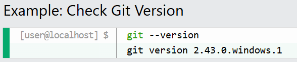

If Git is installed, you will see something like git version X.Y.Z
If you see an error, try closing and reopening your terminal, or check that Git is in your PATH.
#

#### Default Editor
During installation, Git asks you to pick a default text editor.

This is the program that will open when you need to write messages (like for commits).

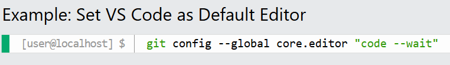

If you're not sure, just pick the default (Notepad on Windows). You can always change this later.

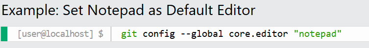
#

#### Common Installation Issues
- "git is not recognized as an internal or external command"
    Solution: Git is not in your system's PATH. Make sure you installed Git and restart your terminal.
    If needed, add Git's bin folder (usually C:\Program Files\Git\bin) to your PATH.
    If it still doesn't work, try restarting your computer.
- Permission errors ("Permission denied")
    Solution: On Windows, run Git Bash or your terminal as administrator.
    On macOS/Linux, use sudo if necessary.
- SSL or HTTPS errors when cloning/pushing
    Solution: Check your internet connection.
    Make sure your Git version is up to date.
- Wrong version of Git
    Solution: Check your installed version with git --version.
    Download the latest version from git-scm.com if needed.
#

#### Configure Git

Configuring Git is safe.
You can change these settings at any time, they only affect how your name and email appear in your commits.
#

#### User Name

Your name will be attached to your commits. Set it with:

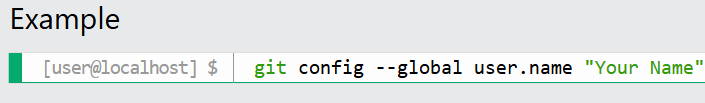
#

#### Email Address 

Your email is also attached to your commits. Set it with:

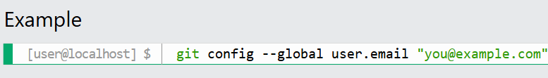

Change the user name and email to your own.

You will probably also want to use this when registering to GitHub later on.
#

#### Configuration Levels

There are three levels of configuration:
- System (all users): git config --system 
- Global (current user): git config --global
- Local (current repo): git config --local

The order of precendence is:

- Local (current repo)
- Global (current user)
- System (all users)

The reason to use the different levels is that you can set different values for different users or repositories.

This can be used for example to set different default branches for different repositories and users.
#

#### Creating Git Folder

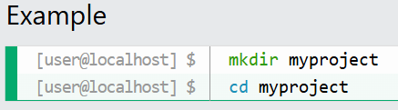

Now we are in the correct directory and can initialize Git!
#

#### Initialize Git

Now that we are in the correct folder, we can initialize Git on that folder:

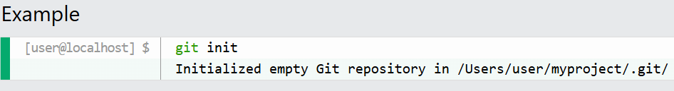

You just created your first Git Repository!
#

#### What is a Repository?
A Git repository is a folder that Git tracks for changes.
The repository stores all your project's history and versions.
#

#### What Happens When You Run git init?
Git creates a hidden folder called .git inside your project.
This is where Git stores all the information it needs to track your files and history.
#

#### What is a New File?
A new file is a file that you have created or copied into your project folder, but haven't told Git to watch.
#

#### What is an Untracked File?
An untracked file is any file in your project folder that Git is not yet tracking.
These are files you've created or copied into the folder, but haven't told Git to watch.
#

#### What is a Tracked File?
A tracked file is a file that Git is watching for changes.
To make a file tracked, you need to add it to the staging area.
#

#### What is the Staging Environment
The staging environment (or staging area) is like a waiting room for your changes.
You use it to tell Git exactly which files you want to include in your next commit.
This gives you control over what goes into your project history.

Here are some key commands for staging:
- git add <file> -Stage a file.
- git add --all or git add -A -Stage all changes
- git status -See what is staged.
- git restore --staged <file> -Unstage a file
#

#### Stage a File with git add

To add a file to the staging area, use git add <file>:

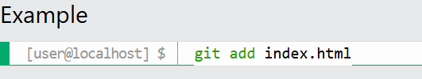
#

#### Stage Multiple Files

You can stage all changes (new, modified, and deleted files) at once:

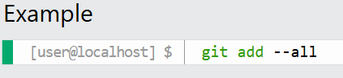

git add -A does the same thing as git add --all.
#

#### Check Staged Files with git status

See which files are staged and ready to commit:

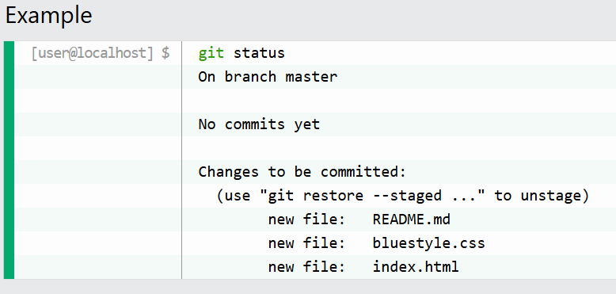
#

#### How to Unstage a File

If you staged a file by mistake, you can remove it from the staging area (unstage it) with:

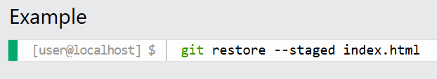

Now index.html is no longer staged. You can also use git reset HEAD index.html for the same effect.
#

#### Git Commit 

#### What is Commit?
A commit is like save point in your project.

It records a snapshot of your files at a certain time, with a message describing what changed.
You can always go back to a previous commit if you need to.

Here are some key commands for commits:
git commit -m "message" - Commit staged changes with a message
git commit -a -m "message" - Commit all tracked changes (skip staging)
git log - See commit history
#

#### How to Commit with a Message (-m)

To save your staged changes, use git commit -m "your message":

#
#### Commit All Changes Without Staging (-a)

You can skip the staging step for already tracked files with git commit -a -m "message".

This commits all modified and deleted files, but not new/untracked files.

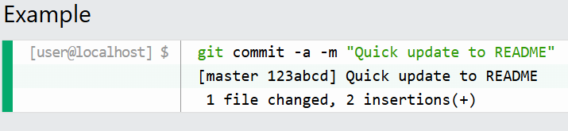
#

#### Write Multi-line Commit Messages

If you just type git commit (no -m), your default editor will open so you can write a detailed, multi-line message:

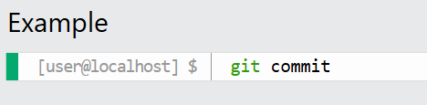
#

#### Commit Message Best Practices:

- Keep the first line short (50 characters or less.)
- Use the imperative mood (e.g., "Add feature" not "Added feature").
- Leave a blank line after the summary, then add more details if needed.
- Describe why the change was made, not just what changed.
#

#### Other Useful Commit Options
- Create an empty commit:
    git commit --allow-empty -m "Start Project"
- Use previous commit message (no editor):
    git commit --no-edit
- Quickly add staged changes to lat commit, keep message:
    git commit --amend --no-edit
#

#### Troubleshooting Common Commit Mistakes

Forgot to stage a file?
If you run git commit -m "message" but forgot to git add a file, just add it and commit again. Or use git commit --amend to add it to your last commit.

Typo in your commit message?
Use git commit --amend -m "Corrected message" to fix the last commit message.

Accidentally committed the wrong files?
You can use git reset --soft HEAD~1 to undo the last commit and keep your changes staged.
#

#### View Commit History (git log)
To view the history of commits for a repository, you can use the git log command:

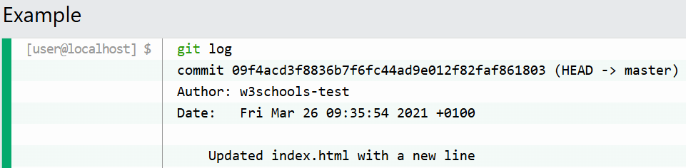

For a shorter view, use git log --oneline:

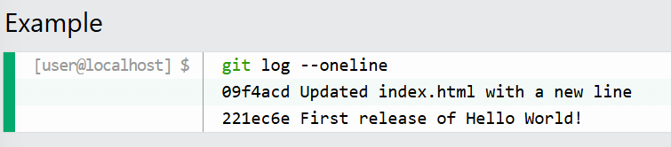

To see which files changed in each commit, use git log --stat:
#

#### Git Tagging

#### What is a Tag?
A tag in Git is like a lebel or bookmark for a specific commit.

Tags are most often used to mark important points in your projects history, like releases(v1.0 or v2.0)

Tags are a simple and reliable way to keep track of versions and share then with your team or users.

Some common tag types include:
    - Release: Tags let you mark when your project is ready for release, so you (and others) can always find that exact version later.
    - Milestone: Use tags to highlight major milestones, like when a big feature is finished or a bug is fixed.
    - Deployments: Many deployment tools use tags to know which version of your code to deply.
    - Hotfixes: If you need to fix an old version, tags make it easy to check out and patch the right code.
#

#### Key Commands for Tagging

    git tag <tagname> -Create a lightweight tag
    git tag -a <tagname> -m "message" -Create an annotated tag
    git tag <tagname> <commit-hash> -Tag a specific commit
    git tag -List tags
    git show <tagname> -Show tag details
#

#### Create a Lightweight Tag

A lightweight tag is just a name for a commit.
It's quick and simple, but does not store extra information.

#### Annotated vs Lightweight Tags
    - Annotated Tag: Stores author, date, and message.
    Recommended for releases and sharing with others.
    - Lightweight Tag: Just a simple name for a commit(no extra info, like a bookmark).

#### Create an Annotated Tag (-a -m)

An annotated tag stores your name, the date, and a message.
This is recommended for most uses.

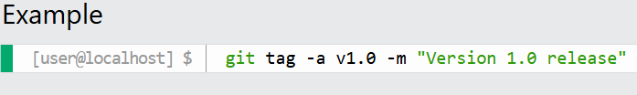

#### Tag a Specific Commit

You can tag an older commit by specifying its hash:

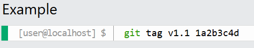

#### List Tags

See all tags in your repository:

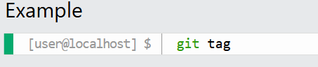

#### Show Tag Details (git show)

See details about a tag and the commit it points to:

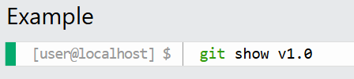

#### Push Tags to Remote

By default, tags exists only on your local computer.
If you want others to see your tags, you need to push them to your remote respository.
If you don't push your tags, only you will see them, and only locally.
To push a single tag to your remote repository (for example, after creating a release tag):

Did you know? Pushing commit with git push does not push your tags!

You must push tags explicitly as shown above.

To push all your local tags to the remote at once (useful if you've created several tags):

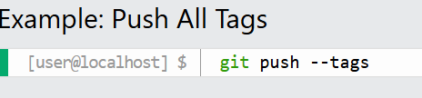

#### Delete Tags

Delete a tag locally:

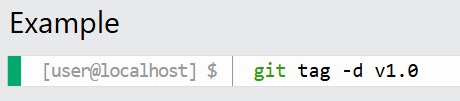

Delete a tag from the remote repository:

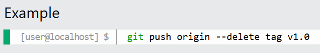

#### Update or Replace a Tag (Force Push)

If you need to move a tag to a different commit and update the remote, use --force:

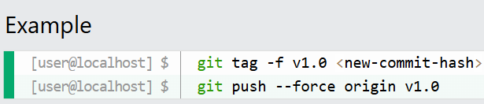

#### Tagging best Practices

- Use tags to mark releases, major milestones, or stable points in your project.
- Always use annotated tags (with -a -m) for anything public or shared.
- Create tags after passing all tests or before deploying/releasing code.

#### Git Stash

#### What is Git Stash? Why Use It?
Sometime you need to quickly switch tasks or fix a bug, but you're not ready to commit your work.
git stash lets you save your uncommitted changes and return to a clean working directory.
You can come back and restore your changes later.

Here are some common use cases:
    - Switch branches safely: Save your work before changing branches.
    - Handle emergencies: Stash your work to fix something urgent, then restore it.
    - Keep your work-in-progress safe: Avoid messy commits or losing changes.

#### Stash Your Changes (git stash)
Save your current changes (both staged and unstaged tracked files) with:

#### What gets stashed?

- Tracked files (both staged and unstaged) are stashed by default.
- Untracked files (new files not yet added to Git) are not stashed by default.
- To stash untracked files too, use git stash -u (or --include-untracked).

#### What is a stash stack?

Each time you run git stash, your changes are saved on top of a "stack".

The most recent stash is on top, and you can apply or drop stashes from the top down, or pick a specific one from the list.

#### Stash with a Message (git stash push -m)

Add a message to remember what you stashed:

This command lets you add a descriptive message to your stash so you can remember what you were working on.

#### List All Stashes (git stash list)
See all your saved stashes:

This command shows all the stashes you have saved so far, with their names and messages.

#### Show Stash Details (git stash show)
See what was changed in the latest stash:

This command gives a summary of what files and changes are in your most recent stash.

#### Apply the Latest Stash (git stash apply)
Restore your most recent stashed changes (keeps the stash in the stack):

This command restores your most recent stashed changes, but keeps the stash in the list so you can use it again if needed.

#### Apply a Specific Stash (git stash apply stash@{n})

Restore a specific stash from the list:

This command lets you restore a specific stash from your list, not just the most recent one.

#### Pop the Stash (git stash pop)

Apply the latest stash and remove it from the stack:

This command restores your most recent stash and removes it from the list at the same time.

#### Drop a Stash (git stash drop)
Delete a specific stash when you no longer need it:

This command deletes a specific stash from your list when you no longer need it

#### Clear All Stashes (git stash clear)
Delete all your stashes at once:

This command deletes all your stashes at once. Be careful! This cannot be undone!

#### Branch from a Stash (git stash branch)
Create a new branch and apply a stash to it.
Useful if your stashed work should become its own feature branch:

This command creates a new branch and applies your stashed changes to it.
This is useful if you decide your work should become its own feature branch.

#### Best Practices for Stashing

- Use clear messages when stashing: git stash push -m "WIP: feature name"
- Don't use stashes as long-term storage-commit your work when possible.
- Check your stash list regularly and clean up old stashes you no longer need.

> [!NOTE]
> Stashes are useful for temporary work, but are not a replacement for commits!

### Git History

Git keeps a detailed record of every change made to your project.
You can use history commands to see what changed, when, and who made the change.
This is useful for tracking progress, finding bugs, and understanding your project's evolution.

#### Key Commands for Viewing History

- git log - Show full commit history
- git log --oneline - Show a summary of commits
- git show <commit> - Show details of a specific commit
- git diff - See unstaged changes
- git diff --staged - See staged changes

#### Best Practices for Viewing History

- Make frequent, meaningful commits to keep your history clear.
- Write clear commit messages so you and your team can understand changes later.
- Use git log --oneline for a quick overview of your commit history.
- Use git diff before committing to review your work.

  #### See Commit History (git log)

This command shows all commits, including author, date, and message.
Use the arrow keys to scroll, and press q to quit.

> [!TIP]
> While viewing the log, you can search for a word by typing / followed by your search term
(for example, /fix), then press n to jump to the next match.
> Press q at any time to quit.

#### Show Commit Details (git show <commit>)

See all the details and changes for a specific commit:

This command shows everything about a commit: who made it, when, the message, and the exact changes.

#### Compare Changes (git diff)

See what is different between your working directory and the last commit (unstaged changes):

This command shows changes you have made but not yet staged for commit.

#### Compare Staged Changes (git diff --staged)

See what is different between your staged files and the last commit:

This command shows changes that are staged and ready to be committed.

#### Compare Two Commits (git diff <commit1> <commit2>)

See what changed between any two commits:

This command shows the differences between two specific commits.

#### Show a Summary of Commits (git log --oneline)

Show a short summary of each commit (great for a quick overview):

This command shows each commit on a single line for easy reading.

#### Show Commits by Author (git log --author="Alice")

See only the commits made by a specific author:

This command filters the log to show only commits by the author you specify.

#### Show Recent Commits (git log --since="2 weeks ago")

See only commits made in the last two weeks:

This command shows only the commits made in a recent time frame.

#### Show Files Changed Per Commit (git log --stat)

See which files were changed in each commit and how many lines were added or removed:

This command adds a summary of file changes to each commit in the log.

#### Show a Branch Graph (git log --graph)

See a simple ASCII graph of your branch history (great for visualizing merges):

This command shows a simple graph of your branch and merge history.

#### Troubleshooting

- Can't see your changes? Make sure you have committed your work. Uncommitted changes won't appear in the history.
- Log is too long? Use git log --oneline or git log --since to make it easier to read.
- How do I quit the log view? Press q to exit the log or diff view

> [!NOTE]
> Exploring your history helps you understand what changed, when, and why.

### GIT Branch

#### What is a Git Branch?
In Git, a branch is like a separate workspace where you can make changes and try new ideas without affecting the main project. Think of it as a "parallel universe" for your code.

#### Why Use Branches?
Branches let you work on different parts of a project, like new features or bug fixes, without interfering with the main branch.

#### Common Reasons to Create a Branch

- Developing a new feature
- Fixing a bug
- Experimenting with ideas

#### Example: With and Without Git

Let's say you have a large project, and you need to update the design on it.

How would that work without and with Git:

#### Without Git:

- Make copies of all the relevant files to avoid impacting the live version.
- Start working with the design and find that code depend on code in other files, that also need to be changed!
- Make copies of the dependent files as well. Making sure that every file dependency reference the correct file name
- EMERGENCY! There is an unrelated error somewhere else in the project that needs to be fixed ASAP!
- Save all your files, making a note of the names of the copies you were working on
- Work on the unrelated error and update the code to fix it
- Go back to the design, and finish the work there
- Copy the code or rename the files, so the updated design is on the live version
- (2 weeks later, you realize that the unrelated error was not fixed in the new design version because you copied the files before the fix)

#### With Git:
- With a new branch called new-design, edit the code directly without impacting the main branch
- EMERGENCY! There is an unrelated error somewhere else in the project that needs to be fixed ASAP!
- Create a new branch from the main project called small-error-fix
- Fix the unrelated error and merge the small-error-fix branch with the main branch
- You go back to the new-design branch, and finish the work there
- Merge the new-design branch with main (getting alerted to the small error fix that you were missing)

Branches allow you to work on different parts of a project without impacting the main branch.

When the work is complete, a branch can be merged with the main project.

You can even switch between branches and work on different projects without them interfering with each other.

Branching in Git is very lightweight and fast!

#### Creating a New Branch

Let's say you want to add a new feature. You can create a new branch for it.

Let add some new features to our index.html page.

We are working in our local repository, and we do not want to disturb or possibly wreck the main project.

So we create a new branch:

Now we created a new branch called "hello-world-images"

#### Listing All Branches

Let's confirm that we have created a new branch.

To see all branches in your repository, use:

We can see the new branch with the name "hello-world-images", but the * beside master specifies that we are currently on that branch.

#### Switching Between Branches

checkout is the command used to check out a branch.

Moving us from the current branch, to the one specified at the end of the command:

Now you can work in your new branch without affecting the main branch.

#### Working in a Branch

Now we have moved our current workspace from the master branch, to the new branch

Open your favourite editor and make some changes.

> [!NOTE] 
> Using the -b option on checkout will create a new branch, and move to it, if it does not exist

#### Switching Between Branches

Now let's see just how quick and easy it is to work with different branches, and how well it works.

We are currently on the branch hello-world-images. We added an image to this branch, so let's list the files in the current directory:

#### Emergency Branch

Now imagine that we are not yet done with hello-world-images, but we need to fix an error on master.

I don't want to mess with master directly, and I do not want to mess with hello-world-images, since it is not done yet

So we create a new branch to deal with the emergency:

Now we have created a new branch from master, and changed to it. We can safely fix the error without disturbing the other branches.

#### Deleting a Branch

When you're done with a branch, you can delete it:

This deletes the branch named hello-world-images (if it's already merged).

#### Best Practices for Working with Branches

- Use clear, descriptive branch names (like feature/login-page or bugfix/header-crash).
- Keep each branch focused on a single purpose or feature.
- Regularly merge changes from the main branch to keep your branch up-to-date.
- Delete branches that are no longer needed to keep your repository clean.

#### Practical Examples

- Rename a branch: `git branch -m old-name new-name`
- List all branches: `git branch`
- Switch branches: `git checkout branch-name or git switch branch-name`
- Delete a branch (not merged): `git branch -D branch-name`
- See which branch you're on: `git status`

#### Troubleshooting

If you don't see your changes on the main branch, remember: changes in one branch stay there until you merge them.

When deleting a branch, make sure it's merged first. If you try to delete an unmerged branch, Git will prevent you from doing so.

To force delete an unmerged branch, use git branch -D branch-name.

### Git Branch Merge

#### What is Merging in Git?

Merging in Git means combining the changes from one branch into another.
This is how you bring your work together after working separately on different features or bug fixes.

